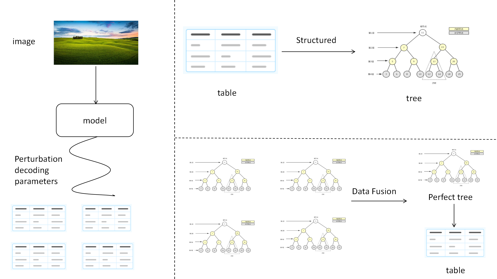

# Mtr-deplot：Chart to Table Model based on a new data fusion method - Perturbation Fusion tree

**Mtr-deplot** is a three-generation model that improves performance by changing the table post-processing method.

We mainly generate different answers by perturbing the decoding parameters of the delpot model, then structure the table in the answer into a tree, and then synthesize the most perfect answer tree as output in a voting weighted form


## Installation

To use C-Delpot, ensure you have Python installed. You will also need to install the necessary dependencies. You can do this by running:

```bash
pip install -r requirements.txt
python main.py
```


