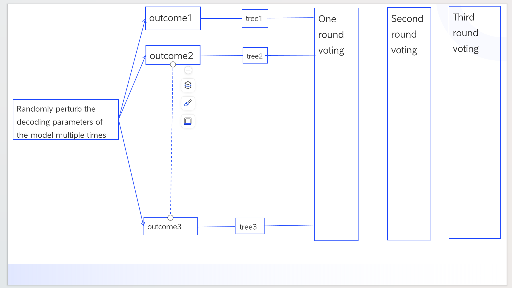

# C-Delpot

**C-Delpot** is a novel approach that leverages perturbation of model decoding parameters followed by data fusion to enhance results. Our method involves introducing random perturbations to the model parameters of **Deplot**, transforming the perturbed outputs into tree structures, and then performing multiple rounds of voting on the generated tables from these trees. This iterative voting process helps to identify and retain the most accurate and reliable results, leading to improved overall outcomes.

## Installation

To use C-Delpot, ensure you have Python installed. You will also need to install the necessary dependencies. You can do this by running:

```bash
pip install -r requirements.txt
python main.py




